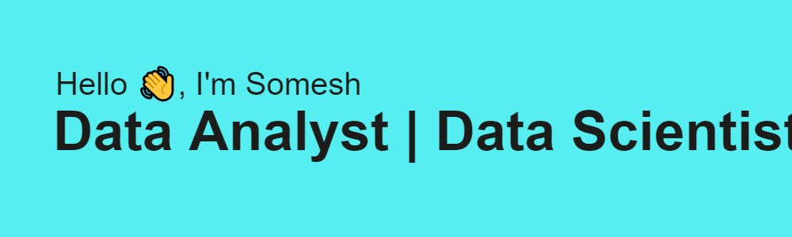

  
  

### 
I'm Somesh, a Data Enthusiast
  
  

- 🔭 I’m currently working on **NLP**  
  

- ❓ Ask me about anything related to Statistics, ML  
  

   

## My Skill Set  
<table><tr><td valign="top" width="33%">

### Languages  

  
  
  
  

</td><td valign="top" width="33%">

### BI Tools  

  
  
  
  

</td><td valign="top" width="33%">

### Frameworks  

  
  
  
  

</td></tr></table>  

   

## Connect with me  

  

  
  

   

## Github Stats  

  

  

 

----

Generated using <a href="https://profilinator.rishav.dev/" target="_blank">Github Profilinator</a>

